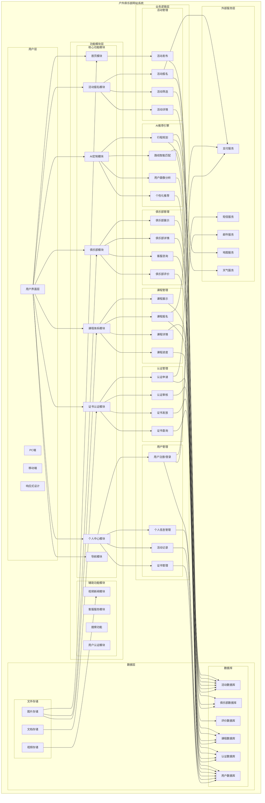

# 户外俱乐部网站系统功能模块架构图

## 系统架构图（Mermaid格式）

## 模块详细说明

### 1. 用户界面层
**功能描述**：提供多终端访问支持，确保良好的用户体验

**子模块**：
- PC端：桌面浏览器访问
- 移动端：手机、平板访问
- 响应式设计：自适应不同屏幕尺寸

---

### 2. 核心功能模块

#### 2.1 首页模块（HomeView）
**功能描述**：网站入口，展示核心服务和内容

**主要功能**：
- 主视觉区域（HeroSection）：展示品牌形象和核心价值
- 活动报名入口
- 俱乐部展示入口
- 课程体系入口
- 证书认证入口
- AI定制入口

**技术实现**：
- 组件化设计
- 响应式布局
- 滚动监听

---

#### 2.2 活动报名模块（ActivitiesSection）
**功能描述**：提供各类户外活动的浏览、筛选和报名服务

**主要功能**：
- 活动类型切换（徒步、攀登、骑行、露营）
- 活动列表展示
- 活动详情查看
- 活动筛选（难度、时长、价格）
- 活动报名
- 俱乐部选择
- 报名信息填写
- 在线支付

**数据结构**：
- 活动ID、名称、图片、描述
- 活动类型、难度、时长、价格
- 活动地点、时间、人数限制
- 俱乐部信息

---

#### 2.3 俱乐部模块（ClubsSection）
**功能描述**：展示合作俱乐部信息，提供俱乐部详情和客服服务

**主要功能**：
- 俱乐部列表展示
- 俱乐部卡片展示
- 俱乐部详情查看
- 俱乐部评价查看
- 客服服务弹窗
- 智能客服对话
- 快速回复功能
- 路线推荐
- 价格咨询
- 装备建议
- 报名指导

**数据结构**：
- 俱乐部ID、名称、图片、描述
- 评分、评价数量
- 主要优势、热门路线
- 路线价格、路线详情
- 评价内容、评价者信息

---

#### 2.4 课程体系模块（CourseSection）
**功能描述**：提供专业户外课程培训和认证服务

**主要功能**：
- 课程列表展示
- 课程卡片展示
- 课程详情查看
- 课程报名
- 课程进度跟踪
- 课程评价
- 证书申请

**课程类型**：
- 山地探索课程
- 山地救援课程
- 山地生存课程
- 青少年课程

**数据结构**：
- 课程ID、名称、图片、描述
- 课程类型、难度、时长、价格
- 课程大纲、学习目标
- 报名人数、评价数量

---

#### 2.5 证书认证模块（CertificateSection）
**功能描述**：提供权威认证服务和证书管理

**主要功能**：
- 认证介绍展示
- 认证标志展示
- 证书优势说明
- 认证申请入口
- 证书查询
- 证书下载
- 证书验证

**认证类型**：
- 国际认证
- 国家认证
- 行业认证

**数据结构**：
- 认证ID、名称、类型
- 认证标准、认证流程
- 证书编号、颁发日期
- 认证状态、有效期

---

#### 2.6 AI定制模块（AICustomSection）
**功能描述**：基于AI算法提供个性化路线推荐和行程规划

**主要功能**：
- 用户信息收集
  - 基本信息（姓名、年龄、性别）
  - 体能信息（身高、体重、运动经验）
  - 偏好信息（活动类型、难度偏好、时长偏好）
  - 时间信息（出行时间、时长）
  - 预算信息（预算范围）
- AI智能分析
- 个性化路线推荐
- 行程规划
- 推荐结果展示

**AI算法**：
- 用户画像分析
- 路线匹配算法
- 个性化推荐引擎
- 多维度评分系统

**数据结构**：
- 用户画像数据
- 路线特征数据
- 历史行为数据
- 推荐结果数据

---

#### 2.7 个人中心模块（PersonalView）
**功能描述**：用户个人信息管理和活动记录查看

**主要功能**：
- 用户信息展示
  - 头像、昵称、等级
  - 注册时间、会员状态
- 个人信息编辑
- 活动记录查看
  - 已报名活动
  - 已完成活动
  - 活动详情
- 证书管理
  - 已获得证书
  - 证书详情
  - 证书下载
- 俱乐部信息
  - 参加的俱乐部
  - 俱乐部活动记录

**数据结构**：
- 用户ID、昵称、头像
- 注册时间、会员等级
- 活动记录列表
- 证书记录列表

---

#### 2.8 导航模块（NavBar）
**功能描述**：网站全局导航和用户操作入口

**主要功能**：
- 网站Logo展示
- 导航菜单
  - 首页
  - 活动报名
  - 俱乐部
  - 课程体系
  - 证书认证
  - AI定制
- 搜索功能
- 用户操作
  - 登录/注册
  - 个人中心
  - 消息通知
- 滚动效果

**交互设计**：
- 响应式菜单
- 滚动监听
- 下拉菜单
- 消息提示

---

### 3. 辅助功能模块

#### 3.1 视频新闻模块（VideoNewsSection）
**功能描述**：展示户外相关视频和新闻资讯

**主要功能**：
- 视频列表展示
- 视频播放
- 新闻列表展示
- 新闻详情查看
- 分类筛选

---

#### 3.2 客服服务模块
**功能描述**：提供在线客服咨询服务

**主要功能**：
- 客服弹窗
- 实时对话
- 快速回复
- 智能问答
- 历史记录

---

#### 3.3 搜索功能
**功能描述**：提供全站搜索服务

**主要功能**：
- 关键词搜索
- 分类搜索
- 搜索结果展示
- 搜索历史

---

#### 3.4 用户认证模块
**功能描述**：用户身份认证和授权

**主要功能**：
- 用户注册
- 用户登录
- 密码找回
- 第三方登录
- 权限管理

---

### 4. 业务逻辑层

#### 4.1 活动管理
- 活动发布：管理员发布新活动
- 活动报名：用户报名参加活动
- 活动筛选：按条件筛选活动
- 活动详情：查看活动详细信息

#### 4.2 俱乐部管理
- 俱乐部展示：展示俱乐部信息
- 俱乐部详情：查看俱乐部详细信息
- 俱乐部评价：用户评价俱乐部
- 客服咨询：在线客服服务

#### 4.3 课程管理
- 课程展示：展示课程信息
- 课程详情：查看课程详细信息
- 课程报名：用户报名参加课程
- 课程进度：跟踪学习进度

#### 4.4 认证管理
- 认证申请：用户申请认证
- 认证审核：管理员审核认证
- 证书发放：发放认证证书
- 证书查询：查询证书信息

#### 4.5 AI推荐引擎
- 用户画像分析：分析用户特征
- 路线智能匹配：匹配适合的路线
- 个性化推荐：推荐个性化内容
- 行程规划：规划出行行程

#### 4.6 用户管理
- 用户注册/登录：用户身份认证
- 个人信息管理：管理用户信息
- 活动记录：记录用户活动
- 证书管理：管理用户证书

---

### 5. 数据层

#### 5.1 数据库
- 用户数据库：存储用户信息
- 活动数据库：存储活动信息
- 俱乐部数据库：存储俱乐部信息
- 课程数据库：存储课程信息
- 认证数据库：存储认证信息
- 评价数据库：存储评价信息

#### 5.2 文件存储
- 图片存储：存储活动、俱乐部、课程图片
- 视频存储：存储视频内容
- 文档存储：存储证书、文档等文件

---

### 6. 外部服务层

#### 6.1 支付服务
- 支付宝支付
- 微信支付
- 银联支付

#### 6.2 短信服务
- 验证码发送
- 通知短信
- 营销短信

#### 6.3 邮件服务
- 注册邮件
- 订单邮件
- 证书邮件

#### 6.4 地图服务
- 地图展示
- 路线规划
- 位置定位

#### 6.5 天气服务
- 天气查询
- 天气预报
- 天气预警

---

## 技术架构

### 前端技术栈
- **框架**：Vue 3
- **路由**：Vue Router
- **状态管理**：Pinia
- **UI组件**：自定义组件
- **样式**：CSS3
- **构建工具**：Vite

### 后端技术栈（建议）
- **框架**：Node.js / Express / Nest.js
- **数据库**：MySQL / PostgreSQL / MongoDB
- **缓存**：Redis
- **文件存储**：OSS / S3
- **消息队列**：RabbitMQ / Kafka

### AI技术栈
- **机器学习**：Python / TensorFlow / PyTorch
- **推荐算法**：协同过滤 / 内容推荐 / 混合推荐
- **自然语言处理**：NLP / 问答系统

---

## 数据流向

### 用户注册流程
1. 用户填写注册信息
2. 前端验证
3. 发送验证码
4. 后端验证
5. 存储用户数据
6. 返回注册成功

### 活动报名流程
1. 用户浏览活动
2. 选择活动
3. 选择俱乐部
4. 填写报名信息
5. 在线支付
6. 生成订单
7. 发送确认短信
8. 更新用户活动记录

### AI推荐流程
1. 用户填写偏好信息
2. AI分析用户画像
3. 匹配路线数据库
4. 计算推荐分数
5. 排序推荐结果
6. 展示推荐路线

---

## 安全架构

### 安全措施
- **身份认证**：JWT Token
- **数据加密**：HTTPS / SSL
- **密码加密**：bcrypt
- **SQL注入防护**：参数化查询
- **XSS防护**：输入验证
- **CSRF防护**：Token验证
- **限流防护**：Rate Limiting

---

## 性能优化

### 优化策略
- **前端优化**：懒加载、代码分割、缓存策略
- **后端优化**：数据库索引、缓存、负载均衡
- **CDN加速**：静态资源CDN
- **图片优化**：压缩、WebP格式
- **接口优化**：接口合并、减少请求次数

---

这个系统功能模块架构图全面展示了户外俱乐部网站的功能结构、技术架构和数据流向，为系统开发和维护提供了清晰的指导。
